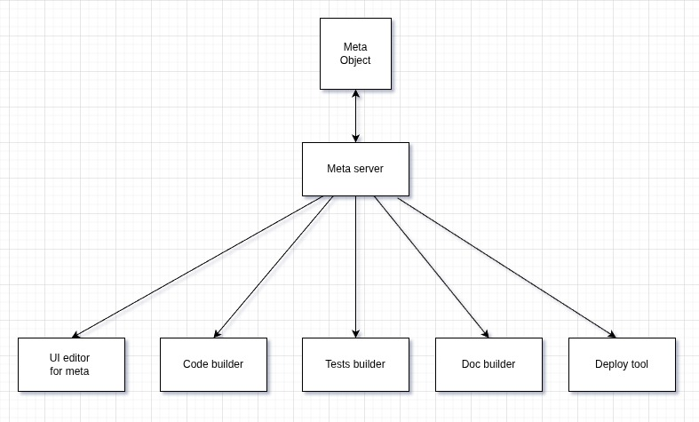

# Meta програмиране

Здравейте днес ще ви запозная с една моя идея и нова 
концепция за разработване на софтуер.

Ще се опитам да представя първо основната идея
и след това да я разширя и да я разгледаме в детайли с частични примери.

Представете си че всичко свързано с даден проект
се описва на едно място по идентичен и семантичен начин.
Тоест цялата информация за проекта и всичко свързано с него
се дефинирана на едно място.

Можем да си представим един голям обект от данни
със всякакви необходими разклонения и подходящи за проекта под структури.

Този обект може да се ползва от редица инструменти, които 
спомагат за автоматизация и проследяване на взаимовръзки при
създаването и развиването на проекта.

Идеята е софтуера да съществува, като описание, а всичко друго около него
да се автоматизира ... тоест описанието да е ядрото на софтуера.


За да не бъдем голословни нека продължим с нагледен пример:


```js
types: {

    username: {
        type: "string",
        min: 1,
        max: 100,
    },

    email: {
        type: "string",
        variant: email,
        min: 1,
        max: 100,
    },

    pass: {
        type: "string",
        min: 1,
        max: 100,
        hash: bcrypt
    },

    id: {
        type: "string",
        variant: uuid,
        version: 4
    },

    text: {
        type: "string",
        min: 1,
        max: 500,
    },

    token: {
        type: "string",
        min: 32,
        max: 32,
    },

},

objects: {

    user: {
        id:    types.id ,
        name:  types.username ,
        email: types.email ,
        pass:  types.pass ,
    },

    comment: {
        id:      types.id ,
        user_id: objects.user.id ,
        content: types.text ,
    },

    session: {
        id:      types.id ,
        user_id: objects.user.id ,
        token:   types.token ,
    },


},


processes:{

    comments: {

        list: {

            in: {
                session: objects.session ,
            },

            use: {
                db: lib.db.table.select ,
            },

            function: '
                var comments = db('comments')
                return comments;
            ',  

            out: {
                data: [objects.comment] ,
            },

        }
    }

},


db:{

    vendor: "mariadb",
    tables: {
        users: [objects.user] ,
        comments: [objects.comment] ,
    }
},

api: {

    endpoints: [

        comments_list: {
            route : 'comments',
            process: processes.comments.list
        }
    ]
},

ui: {

    web_app: {

    },

    mobile_app: {

    },


}

```

Нека да избързам да кажа че това е съвсем орязана и примерна 
структура ... концепцията за мета програмиране по-никакъв
начин не задължава ползването на точно тази структура.

Идеята е нещата от проекта да бъдат описани по-максимално 
семантичен начин така че взаимовръзките да се запазят и да бъдат
лесно проследими.


Нека сега да обърнем внимание на някой части от примера:

---
**types**: са типовете данни, които се ползват като референция там където е нужно
най-вече като атрибути на обекти ... един тип може да се преизползва
в различни обекти и дори да бъде под друго име
```
    user: {
        id:    types.id ,
        name:  types.username ,
        email: types.email ,
        pass:  types.pass ,
    },
```
... ето атрибута **name** на обекта **user** ползва типа **username**
... ето атрибута **id** ползва типа **id** , който се преизползва и от други обекти


---
обекта **comment** има **user_id** което е референция към обекта **user**
това е още едно от местата където съвсем ясно и проследимо 
се описват взаимовръзките
```
    comment: {
        id:      types.id ,
        user_id: objects.user.id ,
        content: types.text ,
    },
```


---
**processes.comments.list**
е описание на процес което включва:
... input данните
... output данните
... логиката описана със **псевдо код**, който в последствие
 ще може да се "компилира" до какъвто език прецените

---
**db** показва колко удобен и интуитивен е този начин на описване
на структури ... защото таблиците са описани като масив от даден обект.


---
##Нека сега да видим как би заработило цялото нещо:



---
**Meta Object** самият обект  ... въпреки че в примера съм ползвал , нещо като json 
не е задължително мета обекта да се съхранява в този формат 
има много налични технологии които позволяват 
съхраняването и редактирането на обекти по доста по ефективен начин.
... основната идея е да има обект със структура и описани взаимовръзки


---
**Meta server** следващата най-ключова кутийка :D
Освен да чете и променя мета обекта този сървър ще може:
- да проследява липсващи или счупени референции и взаимовръзки
- да намира всички свързани елементи преди редакция
- да премахва безопасно неща от мета обекта


---
**UI editor for meta**
Това е просто интерфейс за Meta server
където по лесен, информиран и удобен начин 
ще могат да се допълват, променят или премахват
елементи и дори цели разклонения на мета обекта.

Тук отново можем да споменем че няма нужда 
от точно дефинирана структура и правила за мета обекта
... всичко ще може да променя и допълва по-безопасен и лесен начин.

Ако искате да смените името на атрибут на даден обект
UI editor-а ще ви представи всички други места където се ползва
този обект и неговият атрибут така че да имате ясно представа
какви места засяга тази промяна и безопасно да осъществите преименуването.

Ако имате нужда да разширите дадено разклонение ...UI editor-а
ще ви покаже на кои места се ползва то за да може да коригирате всичко
без да се получават конфликти
 

---
**Code builder**
Това е ai агент или библиотека способна да изгради
приложенията от нулата
(разбира се към мета сървъра могат да се закачат множество builders
нищо не пречи да имате отделни builders за: api server, web app, mobile app и т.н.)

---
**Tests builder**
Това е ai агент или библиотека способна да изгради
тестове на готовите приложения 

---
**Doc builder**
Това е ai агент или библиотека способна да изгради
цялата документация

---
**Deploy tool**
Това е ai агент или библиотека способна да деплойне
приложенията 
... дори тук отново всичко необходимо за деплоя 
може да бъде описано в мета обекта


---
Знам че примерния мета обект и диаграмата с ползването му са опростени за това тук ще побързам 
да споделя още идеи които пропуснах умишлено:
- може да се сложи история мета обекта 
- може да се сложи event тригер за да се задействат конкретни процедури при промяна
- в мета обекта може да се опише екипа и достъпа му , бележките и желанията на клиента и какво ли още не
- могат да се правят презентации към клиента , тоест tool който е закачен към мета сървъра и изгражда динамично презентация на проекта
- може да се добави и feature което позволява четенето и скриването на конкретни env променливи 
- може буквално да се закачат и откачат всякакви tools към meta сървъра стига да са ви полезни :D
...

---
Мета програмирането измества центъра на проекта към описанието 
тоест описанието се превръща в ядрото на проекта (иначе казано проекта живее в описанието) , 
а всичко друго са просто помощни инструменти за редактиране и автоматизация 


Мета програмирането решава най-често срещания проблем в разработката 
на софтуер, а именно повторението на термини, понятия и тяхното проследяване и взаимовръзки. 

Също така няма значение езика и технологиите, които ще използвате, нито това колко промени ще правите , защото крайният работещ продукт ще бъде генериран от tool .
Пуснали сте api сървър на Java ... утре решавате да пробвате Nodejs ... просто сменяте Code builder-а .. до настройвате Deploy tools и след малко ще имате същото api но на Nodejs :D


Мета програмирането позволява тотално разкачване на логиката и спецификата на проекта
от имплантацията му.